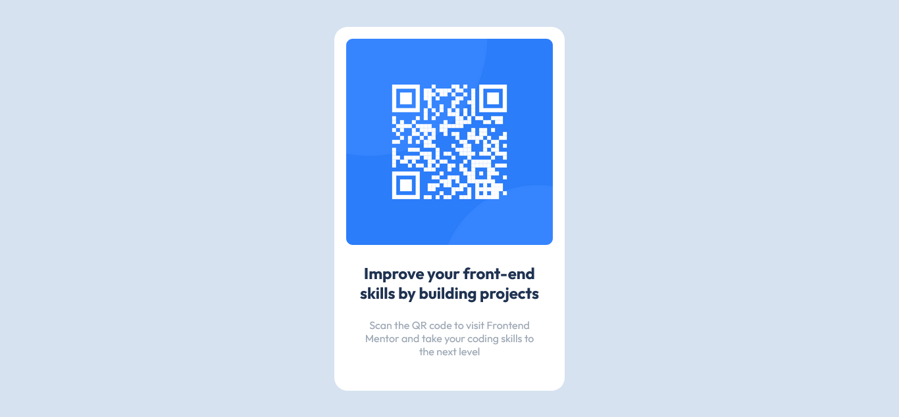
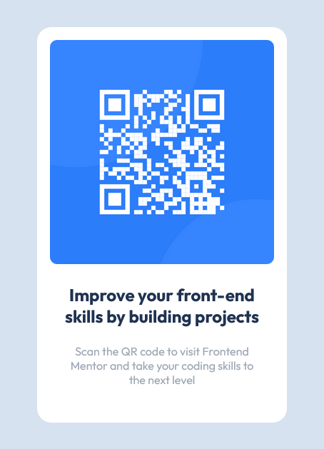

# Frontend Mentor - QR code component solution

This is a solution to the [QR code component challenge on Frontend Mentor](https://www.frontendmentor.io/challenges/qr-code-component-iux_sIO_H). Frontend Mentor challenges help you improve your coding skills by building realistic projects. 

## Table of contents

- [Overview](#overview)
  - [Screenshot](#screenshot)
  - [Links](#links)
- [My process](#my-process)
  - [Built with](#built-with)
  - [What I learned](#what-i-learned)
  - [Useful resources](#useful-resources)
- [Author](#author)

## Overview

The Challenge

Users should be able to:
  - Build out this QR code component and get it looking as close to the design (given) as possible.

### Screenshot

### Links

- Solution URL: [Add solution URL here](https://your-solution-url.com)
- Live Site URL: [Add live site URL here](https://your-live-site-url.com)

## My process

### What I learned

- Learnt how to position elements using position absolute

### Useful resources

- [Advanced positioning](https://www.internetingishard.com/html-and-css/advanced-positioning/) - This wonderful article helped me learn about positioning. 

## Author

- Frontend Mentor - [@dennisthekin](https://www.frontendmentor.io/profile/dennisthekin)
